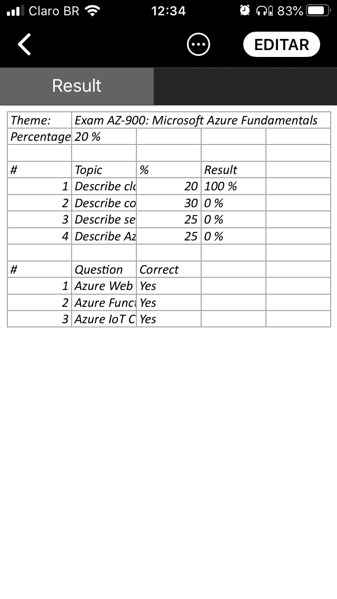
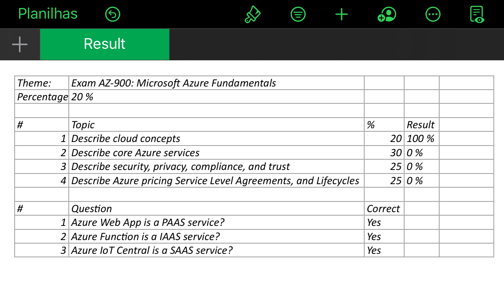

# Questioner
Questioner is a web application that test using questions and answers about a theme to help studying. Developed to be responsive to run in the PC web browser or mobile web browser.sch

## Azure DevOps Status Badge

## IOS ScreenShots

         

## PC ScreenShots

Questioner Home Page

Questioner Topics Page

Questioner Questions Page

Questioner Result Page

Questioner Result Report Download

Questioner Result Report

