# Questioner
Questioner is a web application that test using questions and answers about a theme to help studying. Developed to be responsive to run in the PC web browser or mobile web browser.

## Badge Status

## Setup

### Development environment

- [.NET Core 3.1 SDK](https://dotnet.microsoft.com/download/dotnet-core/3.1)
- [Visual Studio Code](https://code.visualstudio.com/download)
- [SQL Server Express (optional)](https://go.microsoft.com/fwlink/?linkid=866658)

### IIS

- [Host ASP.NET Core on Windows with IIS](https://docs.microsoft.com/en-us/aspnet/core/host-and-deploy/iis/?view=aspnetcore-3.1)
- [Install the .NET Core Hosting Bundle](https://dotnet.microsoft.com/download/dotnet-core/thank-you/runtime-aspnetcore-3.1.6-windows-hosting-bundle-installer)
- [ASP.NET Core Runtime 3.1.6](https://dotnet.microsoft.com/download/dotnet-core/thank-you/runtime-aspnetcore-3.1.6-windows-x64-installer)

## Screenshots

### IOS

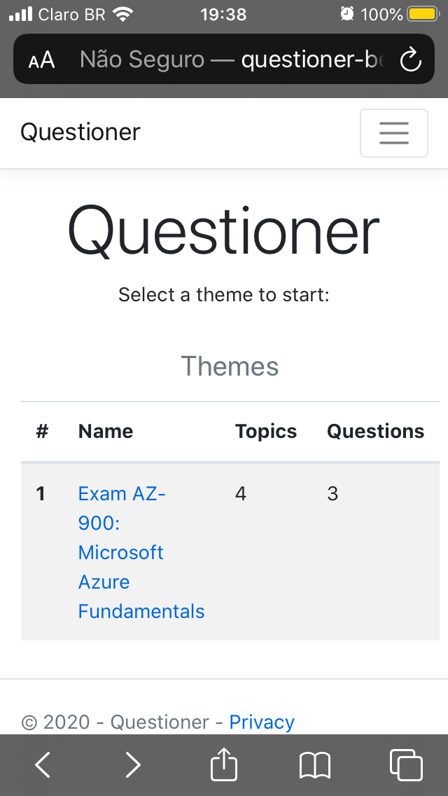 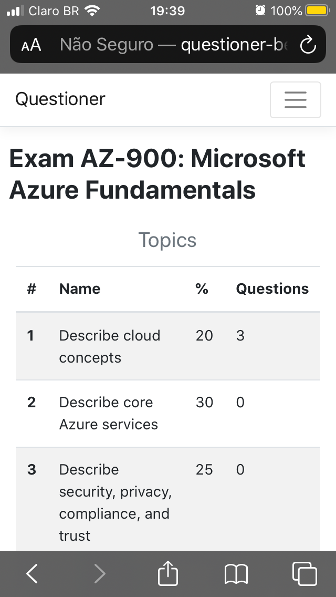 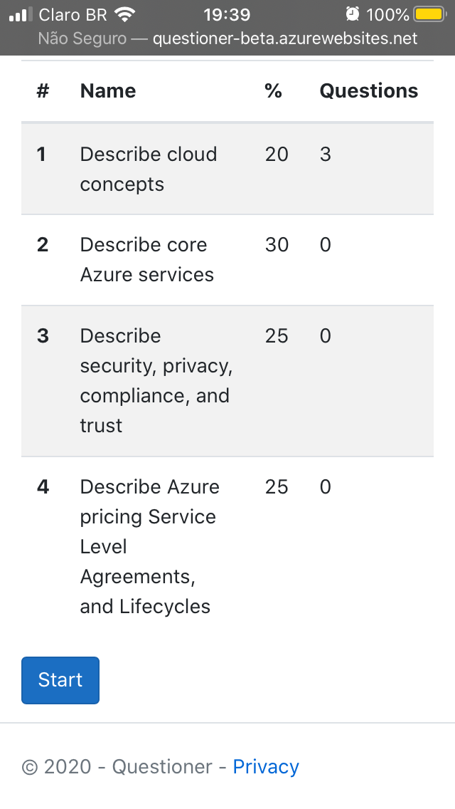 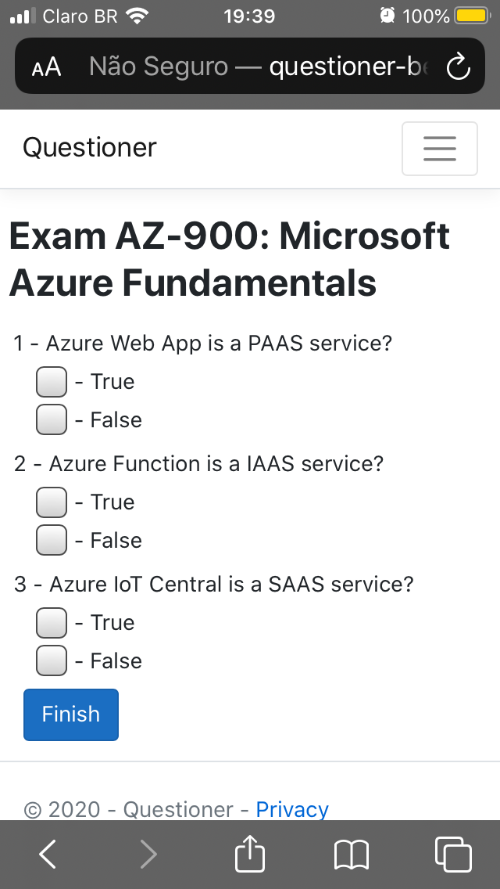 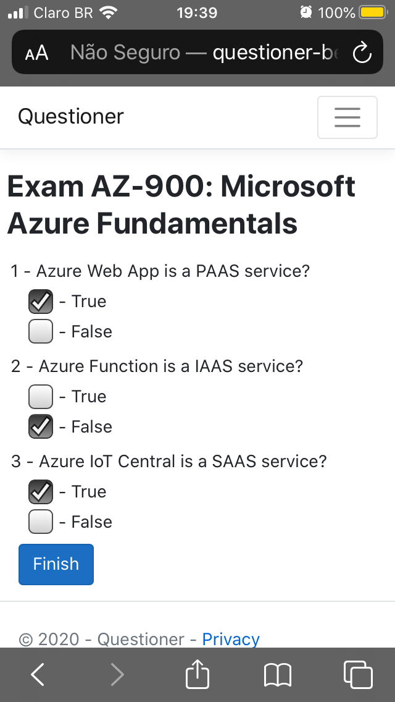 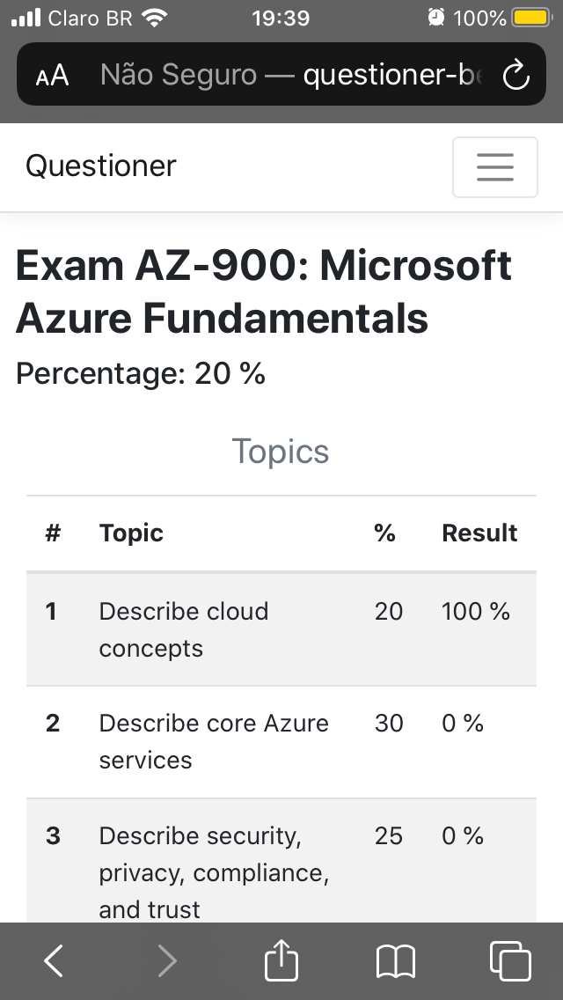 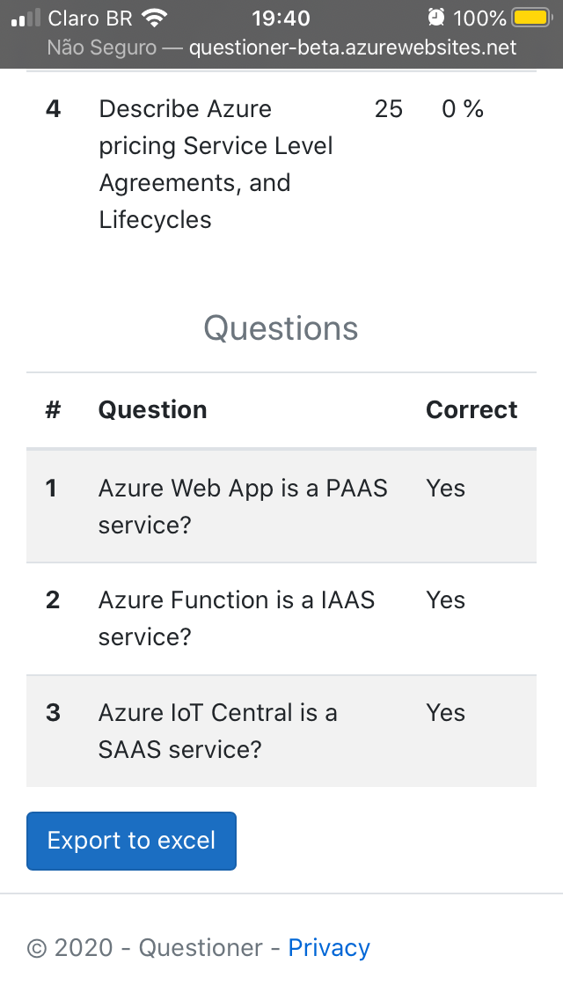 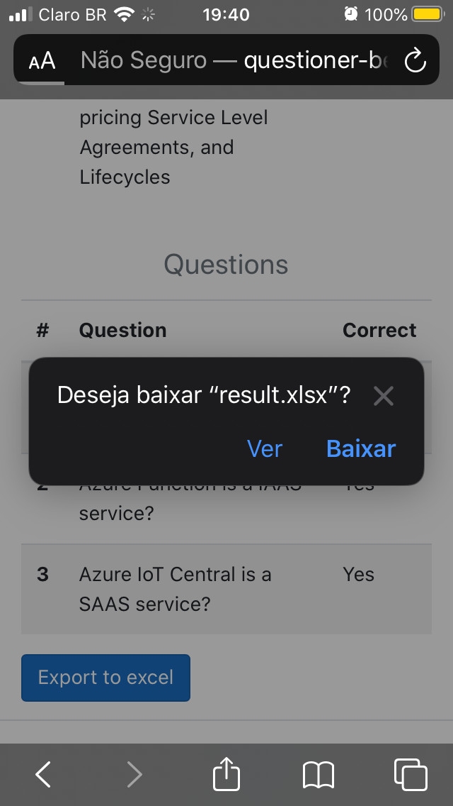 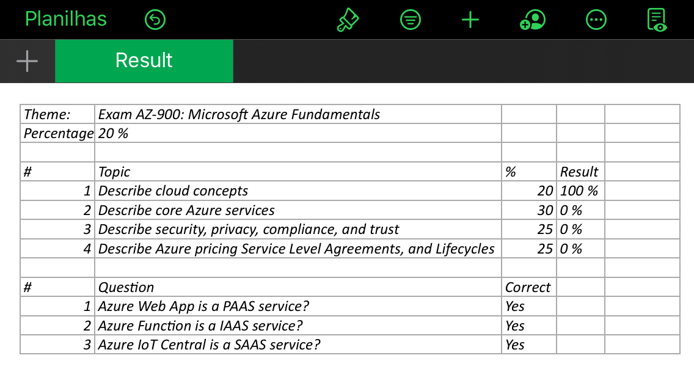

### PC

#### Questioner Home Page
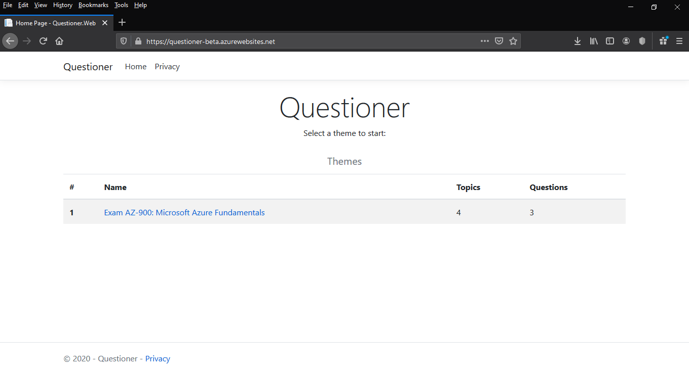

#### Questioner Topics Page
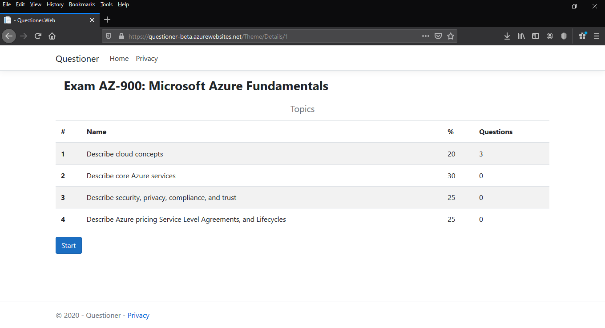

#### Questioner Questions Page
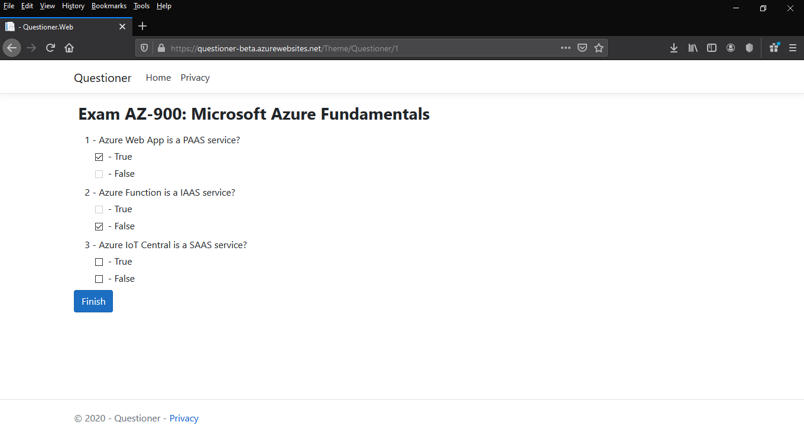

#### Questioner Result Page
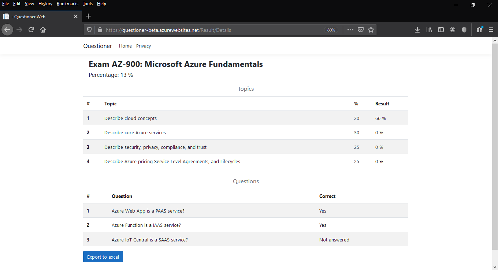

#### Questioner Result Report Download
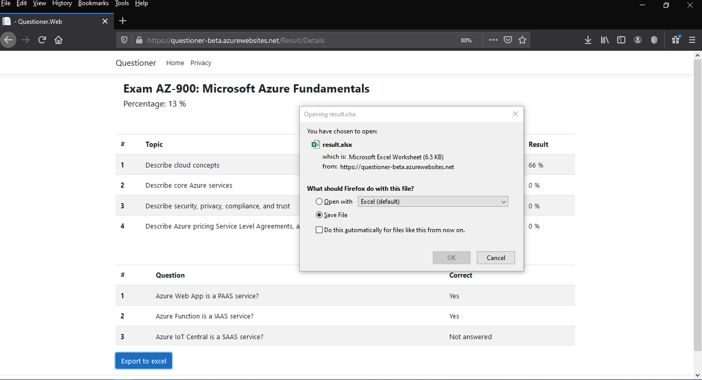

#### Questioner Result Report
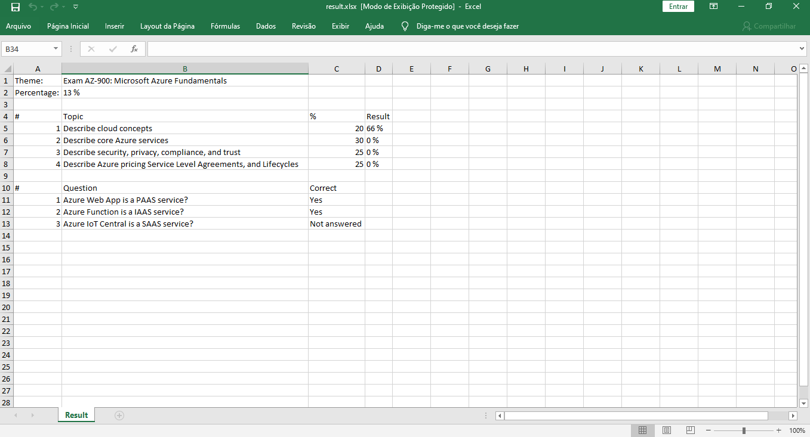

## Pipelines

### Azure DevOps

- [Build](https://github.com/henriq-toledo/questioner/blob/master/pipelines/azure-devops/azure-pipelines.yml)
- [Release](https://github.com/henriq-toledo/questioner/blob/master/pipelines/azure-devops/azure-release-pipeline.yml)

### Jenkins

#### [Web App Jenkins Pipeline](https://github.com/henriq-toledo/questioner/tree/master/pipelines/jenkins/web-app/Jenkinsfile)
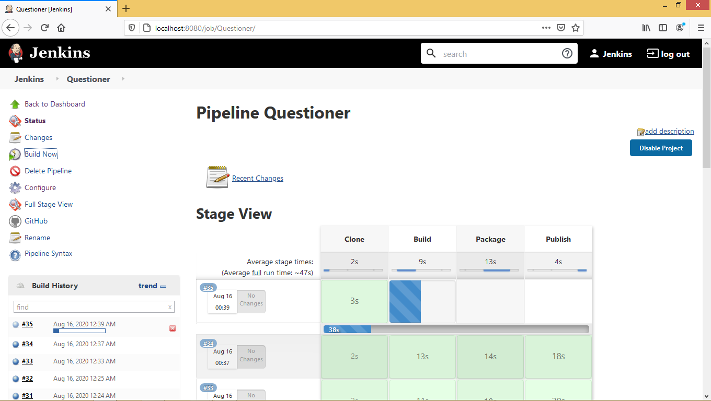

#### [Web Api Jenkins Pipeline](https://github.com/henriq-toledo/questioner/tree/master/pipelines/jenkins/web-api/Jenkinsfile)
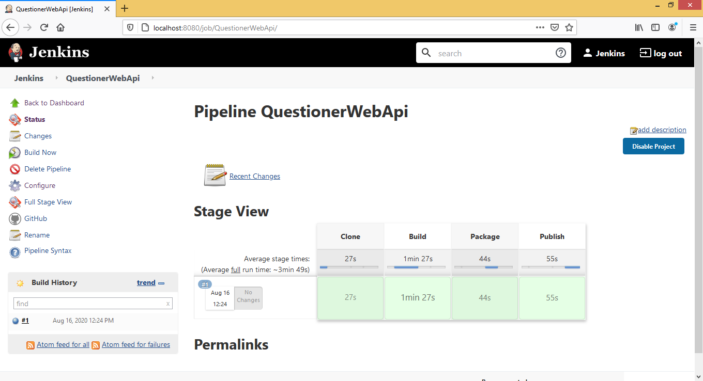